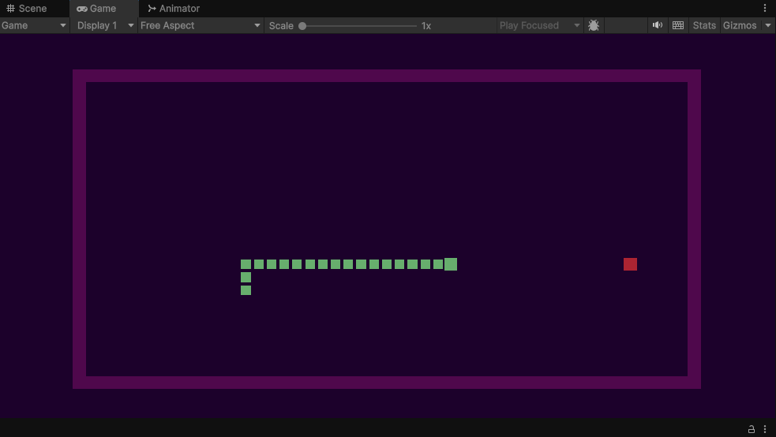

# Snake game

> Змейка — это общее название концепции видеоигры, в которой игрок управляет линией, увеличивающейся в длину, причём сама линия становится главным препятствием.
> Концепция появилась в аркадной игре Blockade 1976 года, а простота реализации «Змейки» привела к созданию сотен её версий (некоторые из которых содержат в названии слова snake или worm) для множества платформ.
>  После того как одна из вариаций игры была предустановлена на мобильные телефоны Nokia в 1998 году, интерес к концепции возродился благодаря тому, что она получила гораздо более широкую аудиторию.

Темы: 
- движение по сетке

Версия: Unity 6000.0.36f1 (LTS)
